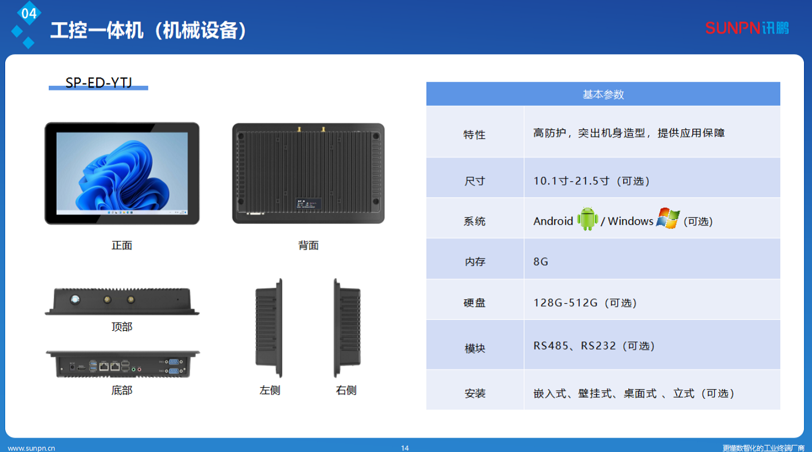

---

title: 装配车间 MES 配套安卓一体机采购及部署方案
description: 持续维护

---

## 装配车间 MES 配套安卓一体机采购及部署方案

## 1. 核心需求分析

- **交互终端：** 运行 MES 客户端，实现投料信息确认与组长复核。
- **环境适应：** 适用于用料检查、BOM查询、工单执行等场景。

------

## 2. 硬件技术规格建议

为确保系统运行流畅，建议采用以下硬件参数配置：

21.5寸工控一体机，全封闭款，配置：RK3568，8G+128G，WIFI+网口
未税价：2450元一台
含税价：2768元一台

## 3. 功能应用场景设计

#### 场景 A：扫码投料（工位端）

- **流程：** 工人扫描物料批次码 -> MES 自动核对 BOM 表 -> 屏幕显示“通过/阻断”。
- **硬件配合：** 一体机侧边或底部悬挂**有线/无线工业扫码枪**。

#### 场景 B：组长统一复核

- **流程：** 组长批量扫描整线物料，系统对比物料使用正确与否。

------

## 4. 批判性评估

#### 优势（Pros）

- **高兼容性：** 安卓系统成本低于 Windows，且与 MES 适配度极高。
- 解决目前生产线没有终端查询数据的问题

------

## 5. 置信度评级与实施逻辑

- **置信度评级：高 (High)**
- **逻辑依据：** 该配置基于目前主流汽车及电子装配车间通用标准。RK3568 平台是工业安卓机的成熟方案，稳定性已经过大规模市场验证。

------

## 6. 采购执行清单（Checklist）

1. [ ] **PDA样机流程测试**
2. [ ] **固定方式：** 根据现场情况确认是 **VESA 支架挂墙**、**悬臂支撑**还是**嵌入式安装**。
3. [ ] **扫码枪匹配：** 确认扫码枪为 **HID 模式（模拟键盘）** 还是 **虚拟串口模式**，确保与 MES 软件逻辑一致。

# 制造车间 RFID 报工与 ERP 入库集成方案

## 一、 核心本质拆解：业务前置与物理触发

方案本质是：**信息流前置处理，实物流后置触发，实现物理世界的绝对账实相符**。

- **MES 报工前置**：在车间工位打包区，通过人工（手持 PDA 或桌面工作站）将实物与确定的生产工单绑定，提前在 MES 内部完成逻辑上的“报工”。
- **通道门触发后置**：检验出口的通道门作为物理卡点（Checkpoint）。它仅负责核验“即将推往的实物”上的标签是否完全匹配 MES 的报工数据，并在核对无误后，瞬间触发金蝶 ERP 的账务流转。

## 二、 整体系统架构与数据流转层级

系统整体划分为四层架构，各层级职责完成了严格的解耦：

| **系统层级**           | **核心节点与载体**          | **核心动作与职责定义**                                       | **数据状态转化**                                |
| ---------------------- | --------------------------- | ------------------------------------------------------------ | ----------------------------------------------- |
| **操作执行层（前置）** | 桌面 RFID 读写器 / 手持 PDA | **业务发源地**：扫码识别 RFID，绑定当前生产工单，系统内执行 MES 报工。 | 实体标签--> MES 系统内报工记录                  |
| **物理核对层（后置）** | RFID 通道门                 | **物理触发器**：推车出库时批量读取标签 EPC，捕捉真实的实物转移 | 射频信号-->待核对的 EPC 数组                    |
| **边缘控制与枢纽层**   | MES 后台                    | **逻辑校验器**：比对通道门读到的 EPC 数组与 MES 中【已报工】清单是否吻合。控制现场放行或报警。 | EPC 数组-->校验通过的合法过门指令               |
| **集成与应用层**       | RFID通道门+金蝶 ERP         | **固化器**：查表映射主数据；调用金蝶 WebAPI 生成并审核单据。 | 过门指令-->ERP **生产汇报单** 与 **完工入库单** |

## 三、 核心业务流程闭环

1. **工位前置报工与赋码绑定**：
    - 在成品工位，员工使用 PDA读取 RFID 标签。
    - 员工在 MES 报工界面完成报工生成报工记录和rfid标签条码绑定。
2. **检验装车与物理过门校验**：
    - 物料装车，推至检验出口通道门。光电触发天线进行无差别群读。
    - 读取到的批量 EPC 码实时上传至 MES 进行状态校验。
3. **防呆拦截与触发流转**：
    - **情景 A（完全匹配）**：通道门读取的标签MES系统状态全部为“已报工”。系统亮绿灯，MES 提取这些标签背后的工单与物料信息，打包为标准 JSON 推送给金蝶。
    - **情景 B（异常混入）**：读到未在 MES 报工的“白卡”。系统亮红灯、蜂鸣器报警，数据拦截，不向后推流。现场人员需复核实物。
    - **情景 C（实物漏读）**：若 MES 报工了 50 个，但通道门只读到 48 个。系统报警，拦截放行，确保未过门的实物绝对不会在 ERP 中生成入库单。
4. **ERP 固化**：
    - 通道门接收到 MES 的合法放行状态，执行金蝶调用金蝶 WebAPI创建/审核【生产汇报单】 --> 创建【完工入库单】

## 四、 优势与劣势/风险

## 核心优势

- **彻底杜绝“盲读串单”现象**：解决人工判断或产线实物确认，解决生管手工做生产汇报，通道门做客观的物理校验，数据准确度呈现指数级提升。
- **支持灵活的拼车物流**：由于每个标签已提前绑定了各自的工单信息，一辆推车上可以混合放置多个不同工单、不同批次的成品。通道门读取后，MES 和RFID设备可以自动按照工单号进行分组拆单，分别调用 ERP 接口。

## 劣势（风险）与置信度评级

| **风险维度**                       | **逻辑依据与风险描述**                                       | **置信度评级** | **应对方案与架构补偿**                                       |
| ---------------------------------- | ------------------------------------------------------------ | -------------- | ------------------------------------------------------------ |
| **MES 孤儿数据风险（账实不同步）** | 员工在工位完成了 MES 报工，但实物在推往通道门途中被拿走（如抽检或损坏）。这会导致该产品在 MES 中永远停留在“待入库”状态，而 ERP 永远不产生数据。 | **中**         | 需在 MES 端开发“超时预警看板”。对于报工后超过 24 小时仍未产生过门记录的标签，系统自动标红，提醒车间主管介入清查物理去向。 |
| **通道门网络断联导致拦截失败**     | 若通道门工控机与 MES 服务器网络中断，推车经过时无法实时校验标签状态。 | **低**         | 通道门工控机必须设置“断网默认红灯锁止”机制（Fail-Safe）。恢复网络前，禁止任何物料跨越物理边界。 |

