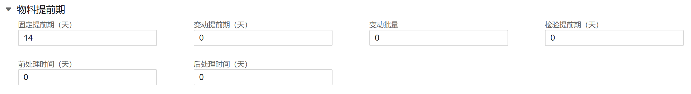
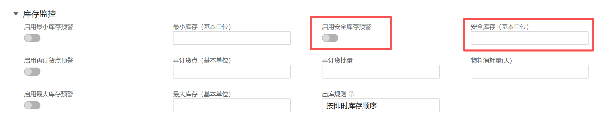

在ERP（企业资源计划）系统中，辅助计划排程（Advanced Planning and Scheduling, APS 或 MRP 运算）的核心在于通过一系列控制字段来驱动生产和采购建议。

这些字段直接决定了系统“什么时候下单”以及“下单买多少”。以下是驱动排程的几类关键字段：

### 1. 时间类字段（提前期 - Lead Time）
这些字段决定了计划的开工日期和到货日期。

固定提前期 (Fixed Lead Time)： 与订单数量无关的等待时间（如报检、排队、准备工装的时间）。

变动提前期 (Variable Lead Time)： 随数量增减的时间（如每加工一件需要0.5小时）。

累计提前期 (Cumulative Lead Time)： 从采购原材料到最终成品完成的总耗时。

采购/生产提前期： 供应商送货所需时间或车间加工所需时间。

安全提前期 (Safety Lead Time)： 为了应对物流或生产波动，人为预留的宽裕时间。

### 2. 数量控制类字段（批量策略 - Lot Sizing）
这些字段决定了系统建议生成的订单规模。

固定批量 (Fixed Order Quantity)： 无论需求多少，每次下单必须是固定值（如一箱100个）。

最小/最大批量 (Min/Max Lot Size)： 限制单次订单的最低起订量或单次处理上限。

批量增量 (Lot Increment)： 必须按倍数下单（如5的倍数）。

按需订货 (Lot-for-Lot, LFL)： 缺多少订多少，不留库存，适用于昂贵或定制化零件。

期间汇总 (Period of Supply)： 将未来一段时间内（如一周）的所有需求合并成一个订单。

### 3. 库存缓冲类字段

最小库存（再订货点） = (日平均消耗量 \times 采购提前期) + 安全库存

用于应对需求不确定性的“护城河”。

安全库存 (Safety Stock)： 静态的库存底线，低于此值系统会立即触发补货建议。

再订货点 (Reorder Point)： 当库存降至此水平时，启动采购或生产流程。

低位码 (Low Level Code)： 决定MRP运算的先后顺序，确保从顶层到底层逐级分解。
最小库存（再订货点） = (日平均消耗量 \times 采购提前期) + 安全库存

**为什么要设置两个字段**

**紧急程度不同：**
1. 库存降到最小库存：属于正常业务触发，系统生成“采购建议”，按常规流程走即可。
2. 库存降到安全库存：属于“紧急预警”，意味着你的缓冲垫已经开始被消耗，可能需要催货或寻找替代料。

**成本平衡：**

1. 如果把“最小库存”设得太高，会导致频繁下单且库存积压。
2. 如果“安全库存”设得太低，任何一点风吹草动都会导致停工待料。

### 4. 资源与产能字段（针对生产排程）
决定生产计划是否具备可行性。

工作中心 (Work Center)： 生产发生的物理位置或设备组。

额定产能 (Rated Capacity)： 资源在单位时间内能处理的标准工时。

利用率与效率 (Utilization & Efficiency)： 对理论产能进行修正的系数。