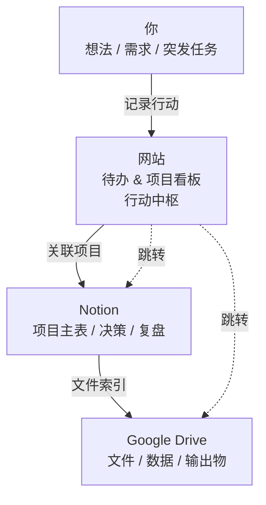

### notion




待办
```
flowchart LR
    A[新增事项出现] --> B{是否可执行?}

    B -- 否 --> C[Notion<br/>想法 / 资料]
    B -- 是 --> D[网站<br/>新增待办]

    D --> E{是否已有项目?}

    E -- 是 --> F[关联已有项目]
    E -- 否 --> G[Notion 新建项目]
    G --> H[Drive 新建项目文件夹]

    F --> I[执行任务]
    H --> I

    I --> J{是否产生决策?}
    J -- 是 --> K[Notion 记录决策]
    J -- 否 --> L[继续执行]

    K --> L
    L --> M[任务完成]
```

drive
```
flowchart TB
    P1[项目想法] --> P2[Notion 创建项目]
    P2 --> P3[定义目标 & 范围]

    P3 --> P4[网站拆解待办]
    P4 --> P5[执行中]

    P5 -->|需求变化| P6[Notion 决策记录]
    P6 --> P4

    P5 --> P7{待办是否清零?}
    P7 -- 否 --> P5
    P7 -- 是 --> P8[项目完成]

    P8 --> P9[Notion 复盘]
    P9 --> P10[Drive 文件归档]

```