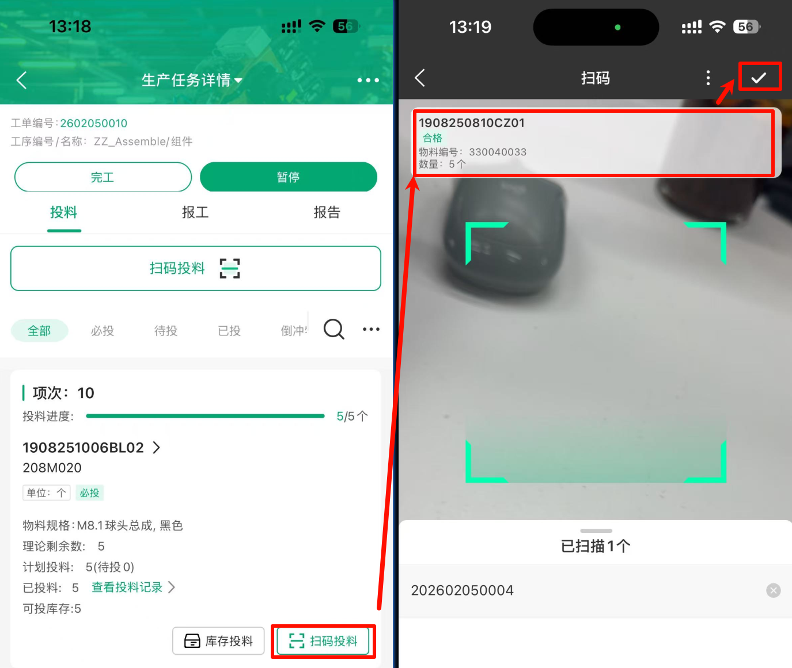
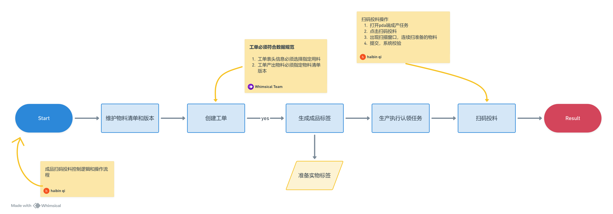
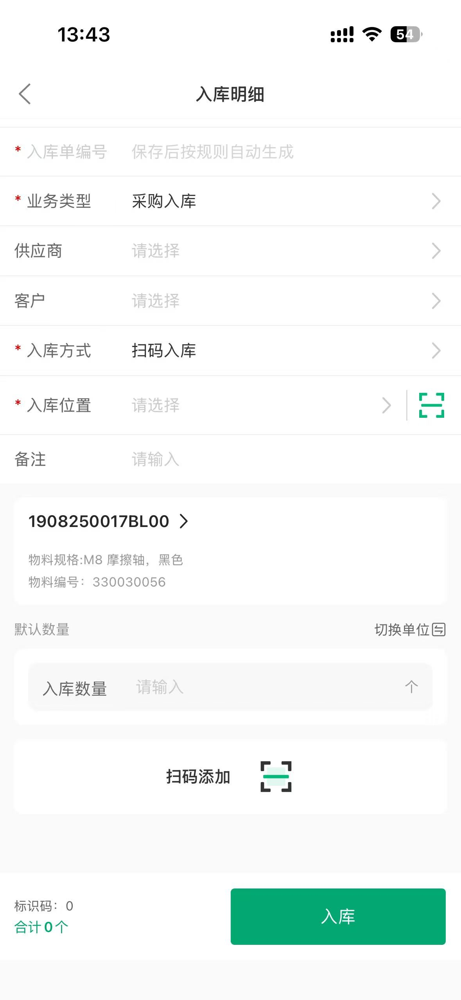

---

title: 黑湖操作文档
description: 更新中

---

## 系统
安卓apk安装包下载地址：http://fir.blacklake.cn/v3pro

## 生产管理

### 生产任务单

**完工的生产任务单调整报工记录**
报工数量达到工单数量后工单自动完工并关闭，如果需要修改，就找到对应的工单做“反关闭”，反关闭到完工状态。最后在APP端报工中点击报工详情调整。

**生产任务单执行人**
- 创建用户（非系统账号、启用、部门）
- 把添加后的用户添加到工作中心资源组中的执行人
- 执行人按部门自动添加
    - 维护用户的所属部门
    - 工作中心添加部门
    - 工单下发选择部门，系统默认关联用户，

投料控制
1. 物料清单设置投料控制是
2. 生产工单新建物料行必须选择对应物料版本，才可以带出用料清单
3. 工单下发任务，在终端操作投料控制
4. 普通入库在终端做，选择物料，选择扫码入库，终端扫描物料批次条码完成入库
5. MES系统现在没有库存和识别号，需要做普通入库

6. 生产任务投料需要做的配置

    a. 物料清单维护版本号

    b. 创建的工单表头指定用料、产出物料必须指定物料版本

    c. 连续扫准备物料条码
sss
    d. 提交投料，系统完成校验

### 生产计划

1. 生成成品标签

	选择对应的产品工单，点击预生成标签，点击查看已生成，点击打印标签
	

**安灯流程**
1. 产线员工发现异常后按按钮触发报警，设备对应的灯闪烁且发出蜂鸣声，员工需要确保声响才可离开
2. 黑湖拥有“系统”角色的用户手机端收到提醒（需要登入过黑湖APP），前往对应产线按下相同按钮此时原灯光闪烁变为常亮，表示处理中
3. 处理人员实际完成异常处理后系统内维护处理人员、处理结束时间、备注填写处理方案保存
4. 第三次按异常按钮，灯光恢复绿色，表示异常处理闭环。

**安灯服务异常**
根据文档排查盛佳瑶电脑主机服务、终端网线、IP端口等

**作业指导书**
通过附件形式上传到物料，生产任务界面点击物料编码可以查看附件

### 生产工单

**导入金蝶生产工单**
1. 配置金蝶生产工单列表，包含所有所需的数据
2. 按列表导出数据
3. mes端用简易导入模板，复制金蝶的数据到模板实施导入

## 仓储

### 普通入库
路劲：APP-功能-仓储-普通入库
1. 搜索物料，点击去入库
2. 输入入库位置、数量
3. 点击“扫码添加”扫描实际库存的标签条码（要求唯一，系统把标签批次号和物料绑定）
4. 最后点击“入库”，完成入库

## 低代码平台

### 模板设计器

**帆软软件**
FineReport模板设计器（**windows_x64_FineReport-CN**）

**时间公式**
日期减一天公式（F7为源字段）：DATETONUMBER(F7)-86400000

### 模型管理_业务对象_标准对象

**新建字段** 
查询对象名称后，点击查看，选择字段，点击新建字段

### 模型管理_业务对象_自定义对象
### 标签样式模板

## 铝山上线计划
数据在浙江腾为，铝山作为车间存在
	1. 铝山人员、账号、部门、工作中心（车间）
	2. 铝山仓库(铝山成品仓、铝山原材料仓……)
	3. 铝山物料、bom、工序、工艺路线（关联部门）

独立铝山环境
	1. 开通新的环境（系统费用）
	2. 基础配置复制浙江腾为或者黑湖来调研事实，具体看生产模式等