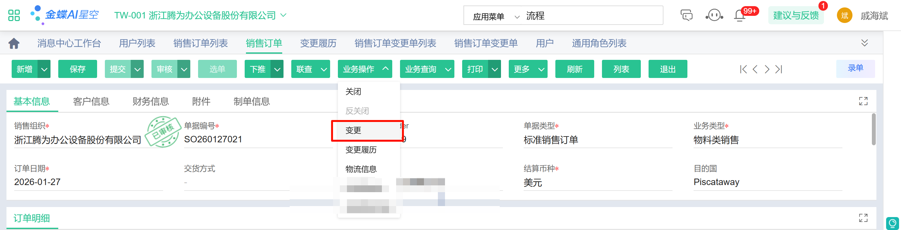
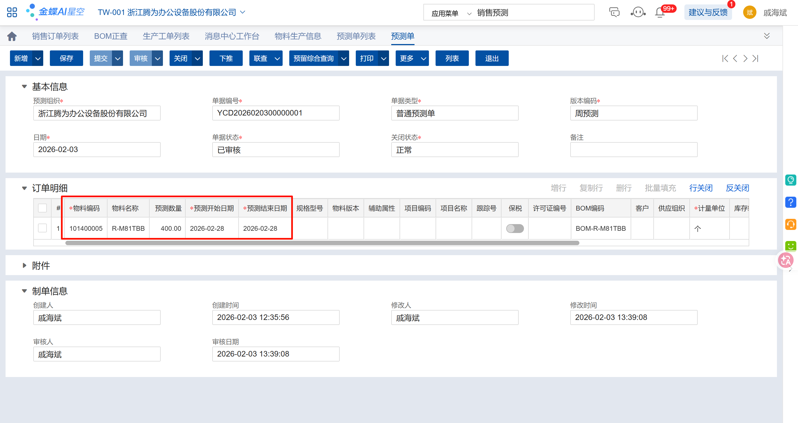

---

title: sales
description: 持续维护

---

1. 销售订单变更单

在销售订单界面，点击“业务操作”、“变更”，系统自动跳转到“销售订单变更单”，维护需要变更的订单行后一次点击“提交“、”审核”、“生效”（注意变更单必须点一次生效）

### 

2. 销售订单新建根据po自动配置结算币种和目的国公式

| PO   | 币种 | 目的国     |
| ---- | ---- | ---------- |
| SP   | RMB  |            |
| BP   | RMB  |            |
| ES   | RMB  |            |
| AP   | USD  |            |
| PC   | USD  |            |
| EA   | USD  |            |
| DP   | USD  | Dublin     |
| ED   | USD  |            |
| NP   | USD  | Nogales    |
| PP   | USD  | Piscataway |
| EP   | USD  |            |

3. 创建预测订单

备货的物料通过预测订单下达，生产制造/需求计划/预测订单，MRP运算选择订单时需要选择预测订单
