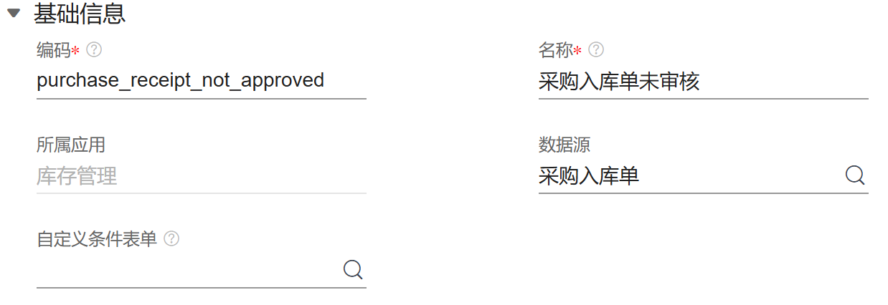
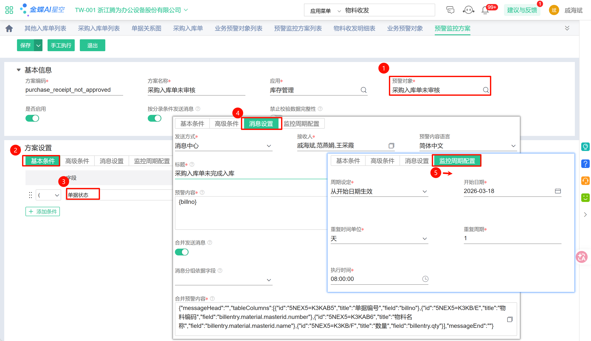
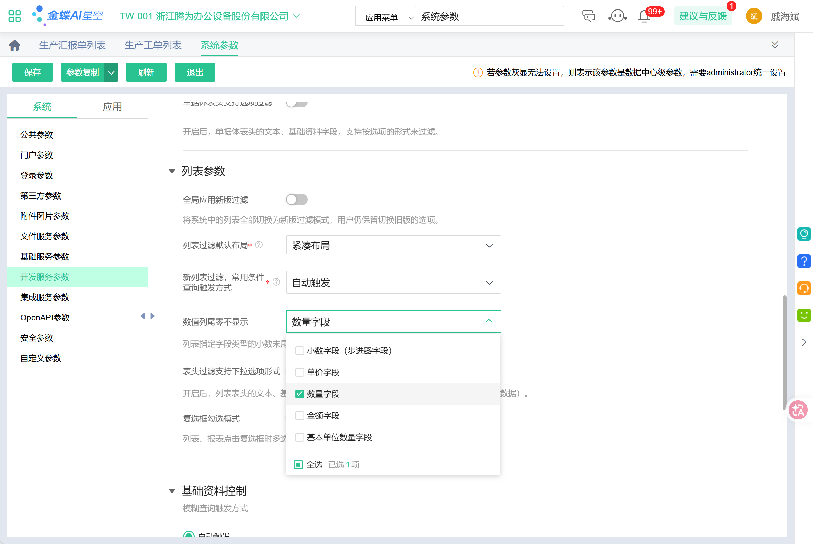

1. 文档

	https://starlight-53z.pages.dev/，账号：docs 密码：.TenwIn!ph

2. 系统新建账号密码密码123456，使用手机登入后系统提示修改密码 
   
3. 列表删除尾零
   
    暂时不支持后台统一配置，需要每个用户自己修改配置，方法如下
	

4. 预警监控方案

    a. 创建“业务预警对象”
    
    
    
    
    b. 创建“预警监控方案”
    

4. 系统参数尾零控制

    此设置优先级最高，不需要用户单独在列表设置

    